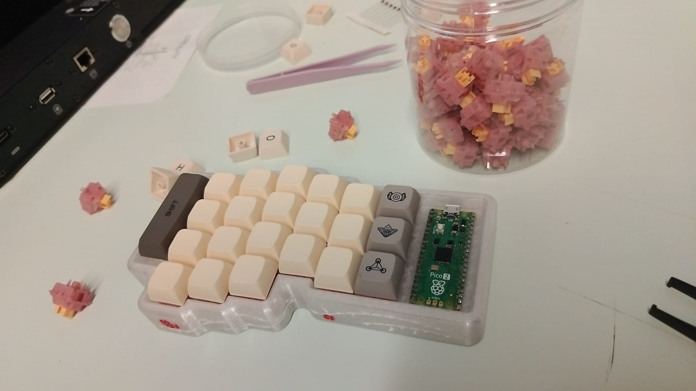
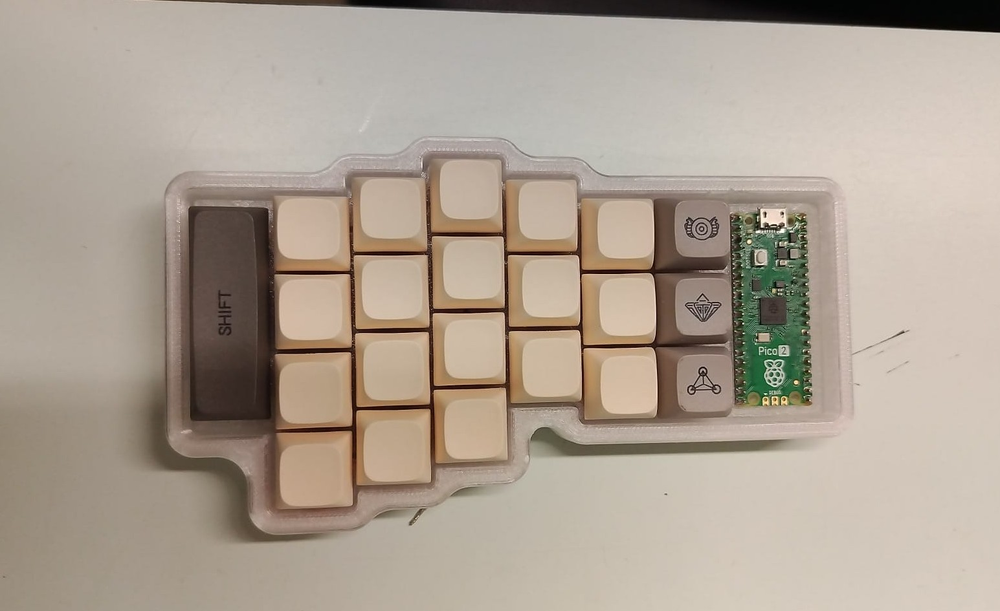

# lver_eos

This is a repo containing 3D design files and firmware for a 44 key split keyboard based on the [scotto44](https://scottokeebs.com/blogs/keyboards/scotto44-handwired-keyboard).

## Images

Overview

Back

Side

Top

## CAD files
The files were made with [Onshape](https://www.onshape.com/en/) and printed on a [Bambulab A1](https://bambulab.com/en-eu/a1) with translucent PETG.

## Firmware
The Raspberry Pi Pico 2s are running standard [QMK](https://qmk.fm/) programmed to the [Neo V2 layout](https://neo-layout.org/) with slight modifications.

## Materials
The plate and sides of case is 3D printed with a translucent PETG with the inlay painted with acrylic paint, the bottom is a 1mm thick clear acrylic with rubber feed.
To give rigidity to the matrix 1.5mmØ copper cable is used and smaller stranded and single wire cable is used for the connections.